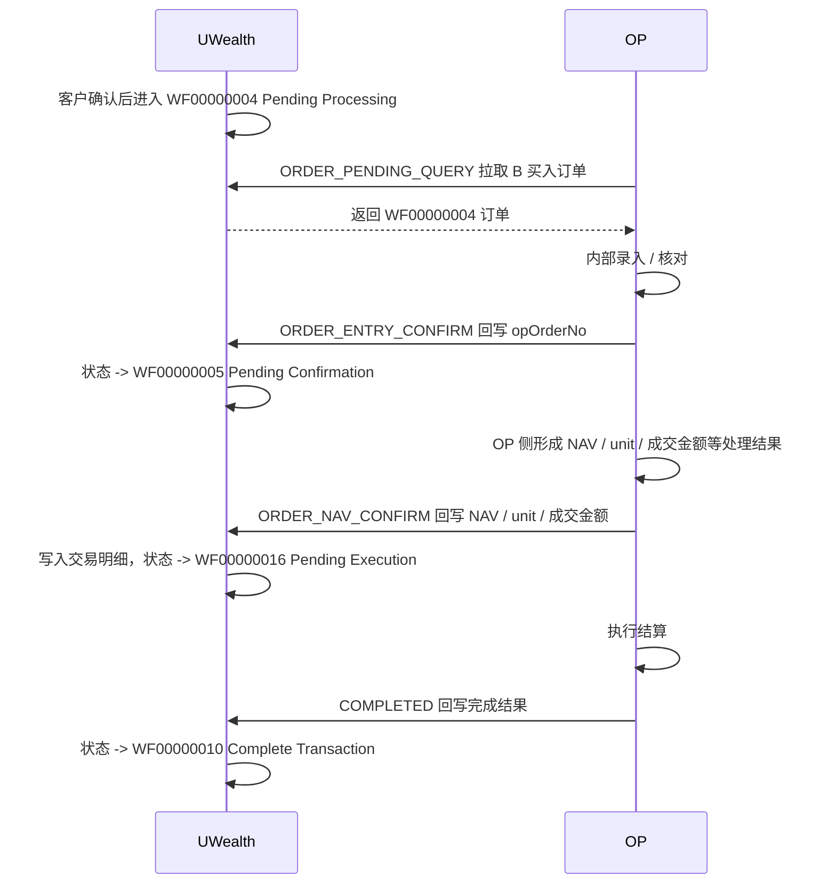
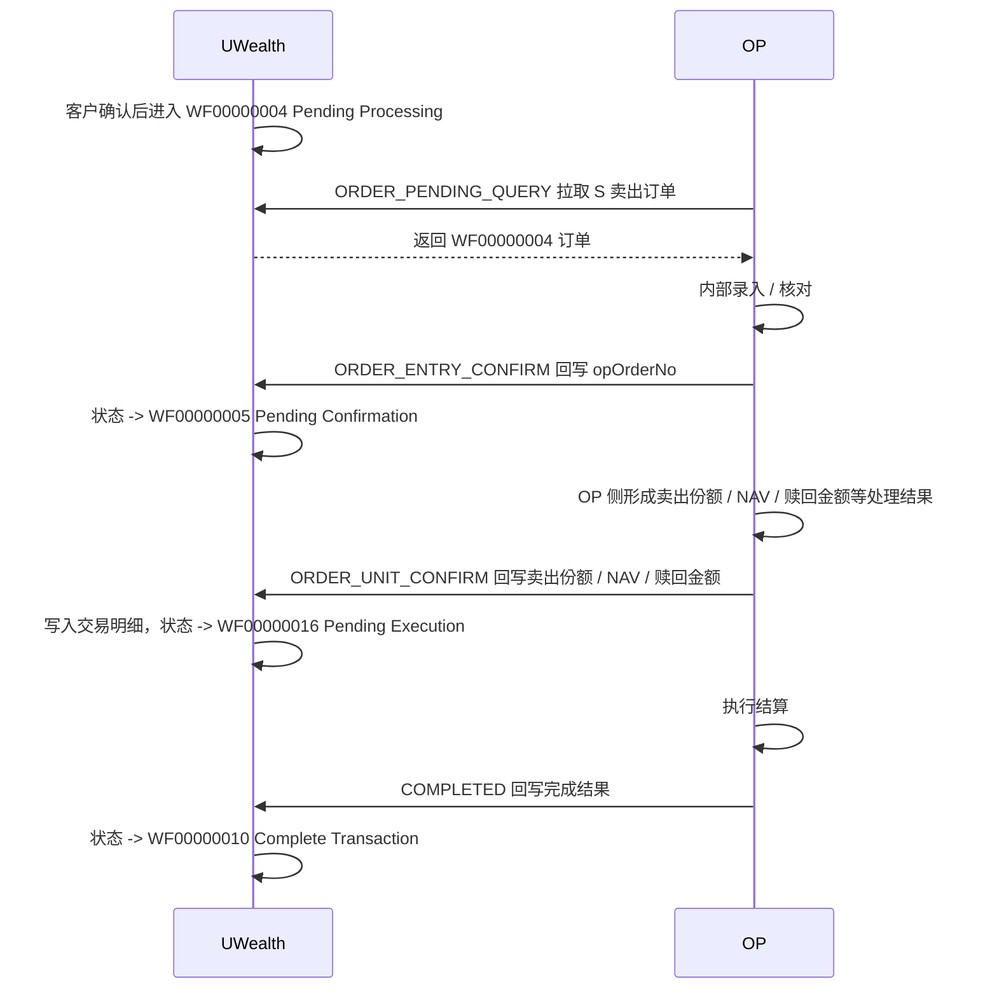
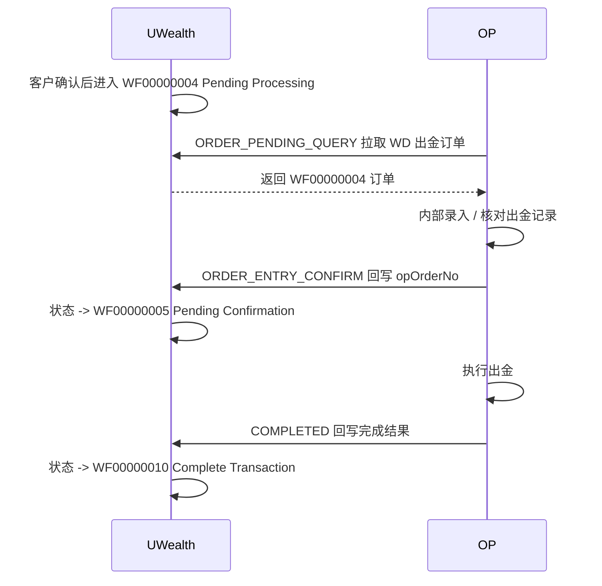
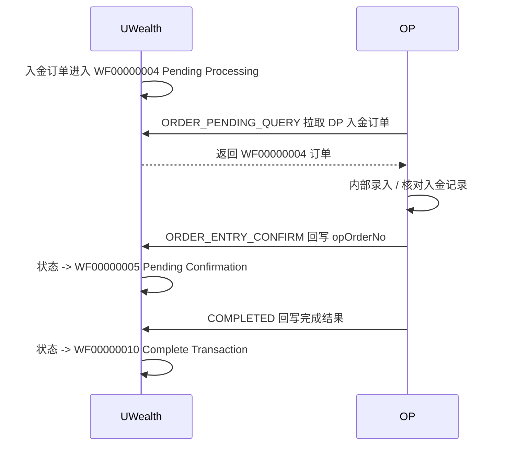

# OP 系统对接 UWealth 统一接口文档 Demo

## 目录

- [1. 文档说明](#1-文档说明)
- [2. 接口地址](#2-接口地址)
- [3. 鉴权方式](#3-鉴权方式)
- [4. 统一请求格式](#4-统一请求格式)
- [5. 统一响应格式](#5-统一响应格式)
- [6. type 类型清单](#6-type-类型清单)
- [7. 订单类型 orderType](#7-订单类型-ordertype)
- [8. 工作流状态码](#8-工作流状态码)
- [9. 逻辑接口一：OP 拉取待处理订单](#9-逻辑接口一op-拉取待处理订单)
- [10. 逻辑接口二：OP 录入确认](#10-逻辑接口二op-录入确认)
- [11. 逻辑接口三：OP NAV 确认](#11-逻辑接口三op-nav-确认)
- [12. 逻辑接口四：OP Unit 确认](#12-逻辑接口四op-unit-确认)
- [13. 逻辑接口五：OP COMPLETED](#13-逻辑接口五op-completed)
- [14. 逻辑接口六：OP 拒绝订单](#14-逻辑接口六op-拒绝订单)
- [15. 逻辑接口七：OP 主动推送交易](#15-逻辑接口七op-主动推送交易)
- [16. 幂等规则](#16-幂等规则)
- [17. 错误码 Demo](#17-错误码-demo)
- [18. 注意事项](#18-注意事项)
- [19. 待补充清单](#19-待补充清单)

## 1. 文档说明

本文档用于说明 OP 系统与 UWealth 系统之间的交易、客户资料等业务对接方式。

OP 系统通过一个固定 HTTP URL 调用 UWealth。不同业务动作通过请求体中的 `type` 字段区分，业务参数统一放在 `request` 字段中。

本文档为 Demo 版本，字段、错误码、特殊业务规则仍需根据 OP 实际报文继续补充。

### 1.1 按 orderType 通讯流程图

以下流程图只展示 UWealth 与 OP 之间的主要通讯节点和关键状态流转，具体字段以各逻辑接口的请求示例为准。

#### B - Buy 买入



#### S - Sell 卖出



#### WD - Withdrawal 出金



#### DP - Deposit 入金



## 2. 接口地址

### 测试环境

```http
POST http://xxxx/openapi/fund/op/commands
```

### 生产环境

```http
POST http://xxxx/openapi/fund/op/commands
```

## 3. 鉴权方式

[openapi-integration-guide.md](openapi/openapi-integration-guide.md)

## 4. 统一请求格式

```json
{
  "type": "ORDER_ENTRY_CONFIRM",
  "version": "1.0",
  "requestId": "550e8400-e29b-41d4-a716-446655440000",
  "timestamp": 1778121000000,
  "request": {}
}
```

### 4.1 公共字段说明

| 字段 | 类型 | 必填 | 说明 |
| --- | --- | --- | --- |
| `type` | string | 是 | 业务动作类型 |
| `version` | string | 是 | 接口版本，默认 `1.0` |
| `requestId` | string | 是 | 请求去重标识，必须全局唯一，建议使用 UUID；UWealth 会根据 `requestId` 去重，若已存在相同 `requestId`，则响应跳过重复处理 |
| `timestamp` | number | 是 | OP 请求时间戳，毫秒 |
| `request` | object | 是 | 业务参数，根据 `type` 不同而不同 |

### 4.2 批量事务规则

每次请求按一个批次整体处理，遵循全成功或全失败规则，不存在部分成功。

当 `request` 为集合类型时，UWealth 必须在同一事务内处理集合内所有记录；只要任意一笔校验或处理失败，本次请求整体失败，已处理的记录必须回滚，并返回失败响应。

## 5. 统一响应格式

UWealth 统一使用 `WealthResult<T>` 返回。

```json
{
  "code": "0",
  "error": null,
  "success": true,
  "data": {}
}
```

### 5.1 响应字段说明

| 字段 | 类型 | 说明 |
| --- | --- | --- |
| `code` | string | 返回码，`0` 表示成功，非 `0` 表示失败 |
| `error` | string | 错误信息，成功时为 `null` |
| `success` | boolean | 本次请求是否整体成功；批量接口中不表示单笔状态 |
| `data` | object | 业务响应数据。非分页接口直接返回业务对象或结果集合；分页接口返回分页对象 |

### 5.2 非分页成功响应示例

非分页接口中，`data` 直接为业务返回值，不额外包装 `type`、`requestId`、`result`。

```json
{
  "code": "0",
  "error": null,
  "success": true,
  "data": {
    "uwOrderNo": "OD251230150042173191",
    "opOrderNo": "OPORD202605070001",
    "workflowCode": "WF00000005"
  }
}
```

### 5.3 分页成功响应示例

分页接口中，`data` 为分页对象，包含 `totalCount` 和 `page`。

```json
{
  "code": "0",
  "error": null,
  "success": true,
  "data": {
    "totalCount": 9224,
    "page": [
      {
        "uwOrderNo": "OD251230150042173191",
        "orderType": "B",
        "workflowCode": "WF00000004",
        "clientCode": "C0001",
        "fundCode": "FUND001",
        "currency": "MYR",
        "amount": 1000.00
      }
    ]
  }
}
```

### 5.4 失败响应示例

失败时 `data` 通常为空，具体是否返回业务上下文由接口实现决定。批量接口失败表示本次请求整体失败，不能出现部分记录成功、部分记录失败。

```json
{
  "code": "0200203",
  "error": "OP order number mismatch",
  "success": false,
  "data": null
}
```

## 6. type 类型清单

| type | 方向 | 说明 |
| --- | --- | --- |
| `ORDER_PENDING_QUERY` | OP -> UWealth | OP 拉取待处理订单 |
| `ORDER_ENTRY_CONFIRM` | OP -> UWealth | OP 录入确认 |
| `ORDER_NAV_CONFIRM` | OP -> UWealth | OP 买入 NAV / unit / 成交金额确认 |
| `ORDER_UNIT_CONFIRM` | OP -> UWealth | OP 卖出份额 / NAV / 赎回金额确认 |
| `COMPLETED` | OP -> UWealth | OP 最终完成回写，将订单推进到 `WF00000010` |
| `ORDER_REJECT` | OP -> UWealth | OP 拒绝订单 |
| `OP_TRANSACTION_PUSH` | OP -> UWealth | OP 主动推送交易，例如 dividend、unit split、interest |
| `CLIENT_ONBOARDING` | OP -> UWealth | 客户开户资料同步 |
| `CLIENT_UPDATE` | OP -> UWealth | 客户资料更新 |

## 7. 订单类型 orderType

| orderType | 说明 | 典型流程 |
| --- | --- | --- |
| `B` | Buy 买入 | WF02 -> WF04 -> WF05 -> WF16 -> WF10 |
| `S` | Sell 卖出 | WF02 -> WF04 -> WF05 -> WF16 -> WF10 |
| `SW` | Switch 基金转换 | WF02 -> WF06 -> WF28 -> WF17 -> WF18 -> WF10 |
| `TI` | Transfer In 单位转入 | WF04 -> WF05 -> WF10 |
| `TO` | Transfer Out 单位转出 | WF04 -> WF05 -> WF10 |
| `DP` | Deposit 入金 | FPX / Cheque / Online Banking |
| `WD` | Withdrawal 出金 | WF02 -> WF04 -> WF05 -> WF10 |
| `DV` | Dividend 分红 | OP 直接写入，完成 WF10 |
| `US` | Unit Split 拆分 | OP 直接写入，完成 WF10 |
| `DN` | Debit Note 扣款 | WF19 -> WF10 |
| `CN` | Credit Note 退款 / 调整 | OP 直接写入，完成 WF10 |
| `FS` | Force Sell 强制卖出 | WF04 -> WF05 -> WF16 -> WF10 |
| `IN` | Interest 利息入账 | OP 直接写入，完成 WF10 |
| `RSP` | 定投计划 | 建立与执行分不同流程 |

## 8. 工作流状态码

| workflowCode | 说明 |
| --- | --- |
| `WF00000002` | Pending Client Approval，等待客户确认 |
| `WF00000004` | Pending Processing，等待 OP 处理 |
| `WF00000005` | Pending Confirmation，等待确认 |
| `WF00000016` | Pending Execution，等待执行 |
| `WF00000010` | Complete Transaction，交易完成 |
| `WF00000015` | Admin Reject，管理员拒绝 |
| `WF00000019` | Partially Paid，部分付款，Debit Note 使用 |

## 9. 逻辑接口一：OP 拉取待处理订单-通用

### 9.1 type

`ORDER_PENDING_QUERY`

### 9.2 说明

OP 系统拉取 UWealth 中等待 OP 处理的订单。UWealth 默认返回所有待 OP 拉取的订单。

**`orderTypes` 为可选过滤条件；如果不传、传 `null` 或传空数组**，则表示拉取所有待 OP 拉取的订单。

注意：入金 `orderType=DP` 且支付方式为 `FPX` 的订单需要排除，具体筛选字段待补充。

### 9.3 请求示例

```json
{
  "type": "ORDER_PENDING_QUERY",
  "version": "1.0",
  "requestId": "550e8400-e29b-41d4-a716-446655440001",
  "timestamp": 1778121000000,
  "request": {
    "orderTypes": ["B", "S", "DP", "WD", "SW", "TI", "TO", "FS"],
    "pageSize": 1000
  }
}
```

### 9.4 响应示例

```json
{
  "code": "0",
  "error": null,
  "success": true,
  "data": {
    "totalCount": 4,
    "page": [
      {
        "uwOrderNo": "OD260406102449381037",
        "orderType": "B",
        "workflowCode": "WF00000004",
        "accountCode": "S02005WW",
        "tradeDate": "2026-04-06 10:24:49.387",
        "trnCode": "UP",
        "stockCode": "F0000170SY",
        "amount": 15000,
        "unit": 0,
        "salesChargeRate": 0,
        "salesChargeAmount": 0,
        "otherFee": 0,
        "orderNo": "OD260406102449381037",
        "orderCurr": "MYR",
        "orderExRate": 1,
        "amountSC": 15000,
        "mode": "ONLINE",
        "remark": "",
        "taxAmount": 0
      },
      {
        "uwOrderNo": "OD260408105203588491",
        "orderType": "S",
        "workflowCode": "WF00000004",
        "accountCode": "L01129WWN",
        "tradeDate": "2026-04-08 10:52:03.593",
        "trnCode": "US",
        "stockCode": "F00001J6AB",
        "amount": 0,
        "unit": "24925.39",
        "salesChargeRate": 0,
        "salesChargeAmount": "0",
        "otherFee": "0",
        "orderNo": "OD260408105203588491",
        "orderCurr": 0,
        "orderExRate": 1,
        "amountSC": 0,
        "mode": "ONLINE",
        "remark": "",
        "taxAmount": "0"
      },
      {
        "uwOrderNo": "OD260410125537104695",
        "orderType": "DP",
        "workflowCode": "WF00000004",
        "accountCode": "C02806WW",
        "depositDate": "2026-04-10 12:55:37.107",
        "depositMethod": "105",
        "bankAccount": "27",
        "currency": "MYR",
        "amount": 30000,
        "salesChargeRate": "2.00",
        "salesChargeAmount": 587.31,
        "otherFee": "0",
        "orderNo": "OD260410125537104695",
        "taxAmount": "46.99"
      },
      {
        "uwOrderNo": "OD260410130307112334",
        "orderType": "WD",
        "workflowCode": "WF00000004",
        "accountCode": "K02028WWN",
        "notificationDate": "2026-04-10 13:03:07.113",
        "wdlType": "P",
        "withdrawCurrency": "MYR",
        "currency": "MYR",
        "amount": 20000,
        "orderNo": "OD260410130307112334"
      }
    ]
  }
}
```

## 10. 逻辑接口二：OP 录入确认-通用

### 10.1 type

`ORDER_ENTRY_CONFIRM`

### 10.2 说明

OP 完成内部录入后，回写 OP 订单号。UWealth 将订单从 `WF00000004` 推进到 `WF00000005`。

### 10.3 请求示例

```json
{
  "type": "ORDER_ENTRY_CONFIRM",
  "version": "1.0",
  "requestId": "550e8400-e29b-41d4-a716-446655440002",
  "timestamp": 1778121300000,
  "request": {
    "uwOrderNo": "OD260406102449381037",
    "opOrderNo": "OP260406102449381037",
    "operator": "OP001",
    "confirmedAt": "2026-05-07T10:35:00+08:00",
    "success":"true"
  }
}
```

### 10.4 响应示例

```json
{
  "code": "0",
  "error": null,
  "success": true,
  "data": [
    {
      "uwOrderNo": "OD260406102449381037",
      "opOrderNo": "OP260406102449381037",
      "success": "true"
    }
  ]
}
```

### 10.5 成功后状态

`WF00000005`

## 11. 逻辑接口三：OP NAV 确认

### 11.1 type

`ORDER_NAV_CONFIRM`

### 11.2 说明

OP 回写买入订单的 NAV、unit、成交金额等信息。UWealth 写入交易明细，并将订单推进到 `WF00000016`。`request` 为集合类型，支持一次提交多笔订单。

### 11.3 请求示例

```json
{
  "type": "ORDER_NAV_CONFIRM",
  "version": "1.0",
  "requestId": "550e8400-e29b-41d4-a716-446655440003",
  "timestamp": 1778139000000,
  "request": [
    {
      "opPkId": "UTF*260400402",
      "uwOrderNo": "OD260406102449381037",
      "clientCode": "S02005WW",
      "unit": 21346.24,
      "nav": 0.7027,
      "branch": "S51",
      "grossAmount": -15000,
      "netAmount": -15000,
      "mGrossAmount": -15000,
      "mNetAmount": -15000,
      "saleChargeAmount": 0,
      "saleChargeRate": 0,
      "currency": "MYR",
      "currencyRate": 1,
      "fundId": "F0000170SY",
      "fundAmount": -15000,
      "fundMAmount": -15000,
      "type": null,
      "status": 1,
      "ipAddress": "169.254.1.2"
    }
  ]
}
```

### 11.4 响应示例

```json
{
  "code": "0",
  "error": null,
  "success": true,
  "data": [
    {
      "uwOrderNo": "OD260406102449381037",
      "opOrderNo": "UTF*260400402",
      "success": "true"
    }
  ]
}
```

### 11.5 成功后状态

`WF00000016`

## 12. 逻辑接口四：OP Unit 确认

### 12.1 type

`ORDER_UNIT_CONFIRM`

### 12.2 说明

OP 回写卖出订单的成交份额、NAV、赎回金额等信息。UWealth 写入交易明细，并将订单推进到 `WF00000016`。`request` 为集合类型，支持一次提交多笔订单。

### 12.3 请求示例

```json
{
  "type": "ORDER_UNIT_CONFIRM",
  "version": "1.0",
  "requestId": "550e8400-e29b-41d4-a716-446655440004",
  "timestamp": 1778139000000,
  "request": [
    {
      "opPkId": "UTF*260400904",
      "uwOrderNo": "OD260408105203588491",
      "clientCode": "L01129WWN",
      "unit": 24925.39,
      "nav": 0.7842,
      "branch": "002",
      "grossAmount": 19546.49,
      "netAmount": 19546.49,
      "mGrossAmount": 19546.49,
      "mNetAmount": 19546.49,
      "saleChargeAmount": 0,
      "saleChargeRate": 0,
      "currency": "MYR",
      "currencyRate": 1,
      "fundId": "F00001J6AB",
      "fundAmount": 0,
      "fundMAmount": 0,
      "type": "S",
      "status": 1,
      "ipAddress": "169.254.1.2"
    }
  ]
}
```

### 12.4 响应示例

```json
{
  "code": "0",
  "error": null,
  "success": true,
  "data": [
    {
      "uwOrderNo": "OD260408105203588491",
      "opOrderNo": "UTF*260400904",
      "success": "true"
    }
  ]
}
```

### 12.5 成功后状态

`WF00000016`

## 13. 逻辑接口五：OP COMPLETED

### 13.1 type

`COMPLETED`

### 13.2 说明

用于 OP 回写最终完成状态，将订单推进到 `WF00000010` Complete Transaction。`request` 为集合类型，支持一次提交多笔订单。

### 13.3 请求示例

```json
{
  "type": "COMPLETED",
  "version": "1.0",
  "requestId": "550e8400-e29b-41d4-a716-446655440005",
  "timestamp": 1778126400000,
  "request": [
    {
      "orderType": "B",
      "uwOrderNo": "OD260406102449381037",
      "clientCode": "S02005WW",
      "workflowCode": "WF00000010",
      "ipAddress": "169.254.1.2"
    },
    {
      "orderType": "S",
      "uwOrderNo": "OD260408105203588491",
      "clientCode": "L01129WWN",
      "workflowCode": "WF00000010",
      "ipAddress": "169.254.1.2"
    },
    {
      "orderType": "DP",
      "opPkId": "CSH*260400251",
      "uwOrderNo": "OD260410125537104695",
      "clientCode": "C02806WW",
      "branch": "004",
      "netAmount": 29365.7,
      "grossAmount": 30000,
      "mNetAmount": 29365.7,
      "mGrossAmount": 30000,
      "currency": "MYR",
      "currencyRate": "1",
      "status": 1,
      "ipAddress": "169.254.1.2"
    },
    {
      "orderType": "WD",
      "opPkId": "SEC*260400108",
      "uwOrderNo": "OD260410130307112334",
      "clientCode": "K02028WWN",
      "branch": "S51",
      "netAmount": -20000,
      "grossAmount": -20000,
      "mNetAmount": -20000,
      "mGrossAmount": 0,
      "currency": "MYR",
      "currencyRate": "1",
      "status": 1,
      "ipAddress": "169.254.1.2"
    }
  ]
}
```

### 13.4 响应示例

```json
{
  "code": "0",
  "error": null,
  "success": true,
  "data": [
    {
      "uwOrderNo": "OD260406102449381037",
      "opOrderNo": "UTF*260400402",
      "success": "true"
    }
  ]
}
```

### 13.5 成功后状态

`WF00000010`

## 14. 逻辑接口六：OP 拒绝订单

### 14.1 type

`ORDER_REJECT`

### 14.2 说明

OP 拒绝订单，UWealth 根据业务规则将订单更新为拒绝状态。`request` 为集合类型，支持一次提交多笔订单。

### 14.3 请求示例

```json
{
  "type": "ORDER_REJECT",
  "version": "1.0",
  "requestId": "550e8400-e29b-41d4-a716-446655440006",
  "timestamp": 1778122800000,
  "request": [
    {
      "uwOrderNo": "OD251230150042173191",
      "opOrderNo": "OPORD202605070001",
      "reason": "Invalid fund account",
      "operator": "OP001"
    }
  ]
}
```

### 14.4 响应示例

```json
{
  "code": "0",
  "error": null,
  "success": true,
  "data": [
    {
      "uwOrderNo": "OD251230150042173191",
      "opOrderNo": "OPORD202605070001",
      "success": "true"
    }
  ]
}
```

## 15. 逻辑接口七：OP 主动推送交易

### 15.1 type

`OP_TRANSACTION_PUSH`

### 15.2 说明

用于 OP 主动推送由 OP 侧产生的交易到 UWealth，例如 Dividend、Unit Split、Credit Note、Interest 等。这类交易不是从 UWealth 订单拉取流程产生，而是由 OP 发起并同步给 UWealth。

| orderType | 说明 |
| --- | --- |
| `DV` | Dividend 分红 |
| `US` | Unit Split 拆分 |
| `CN` | Credit Note 退款 / 调整 |
| `IN` | Interest 利息入账 |

具体 request 字段待补充。`request` 为集合类型，支持一次提交多笔 OP 主动推送交易。

### 15.3 请求示例

```json
{
  "type": "OP_TRANSACTION_PUSH",
  "version": "1.0",
  "requestId": "550e8400-e29b-41d4-a716-446655440007",
  "timestamp": 1778126400000,
  "request": [
    {

    }
  ]
}
```

### 15.4 响应示例

```json
{
  "code": "0",
  "error": null,
  "success": true,
  "data": [
    {
      "uwOrderNo": "OD260507100000000001",
      "opOrderNo": "OP260507100000000001",
      "success": "true"
    }
  ]
}
```

## 16. 幂等规则

UWealth 根据以下字段进行幂等判断：

| 字段 | 说明 |
| --- | --- |
| `requestId` | 请求去重标识，必须全局唯一，建议使用 UUID |
| `type` | 业务动作 |
| `uwOrderNo` | UWealth 订单号，存在时参与校验 |
| `opOrderNo` | OP 订单号，存在时参与校验 |

UWealth 会根据 `requestId` 去重。若已存在相同 `requestId`，系统会响应跳过重复处理，不再执行后续业务动作。

批量请求的幂等粒度为整个请求批次。同一个 `requestId` 重试时，必须返回同一批次的整体处理结果，不能只重放或补偿其中部分记录。

## 17. 错误码 Demo

| code | error | 说明 |
| --- | --- | --- |
| `0` | `null` | 成功 |
| `openapi.sign.verify.fail` | Signature verification failed | 签名验证失败 |
| `0200203` | OP order number mismatch | OP 订单号不匹配 |
| `0200204` | Invalid workflow status | 当前工作流状态不允许执行该操作 |
| `0200205` | Order not found | 订单不存在 |
| `0200206` | Duplicate request | 重复请求 |
| `0200207` | Unsupported command type | 不支持的 `type` |

## 18. 注意事项

1. OP 对接只有一个固定 URL，但每个 `type` 视为一个独立逻辑接口。
2. `request` 字段必须根据 `type` 使用不同的字段规则。
3. `type`、`version`、`requestId` 必须必填。
4. 批量请求必须全成功或全失败；任意一笔失败时，本次请求整体失败并回滚。
5. 成功响应 `data` 中的逐笔 `success` 仅表示成功批次内的结果明细，不代表支持部分成功。
6. 交易状态变更后，UWealth 需要通知 client，具体通知方式待补充。
7. OP 拉取待处理订单时，需排除入金 FPX 类型订单，具体筛选字段待补充。
8. `B`、`S`、`SW`、`FS` 等订单通常走 OP pull `WF00000004` 模式。
9. `DV`、`US`、`CN`、`IN` 等 OP 主动推送交易需要单独补充字段定义。
10. `DP`、`DN`、`RSP` 属于特殊流程，建议后续独立补充章节。

## 19. 待补充清单

| 项目 | 说明 |
| --- | --- |
| OP 真实字段 | 每个 `type` 的真实 request 字段 |
| OP 错误码 | OP 返回或 UWealth 需要暴露给 OP 的错误码 |
| DP 入金规则 | FPX、Cheque、Online Banking 的差异 |
| DN 扣款规则 | Debit Note 部分付款、扣款日期、状态推进规则 |
| RSP 定投规则 | 建立、授权、执行三段流程 |
| 通知规则 | 状态变更后通知 client / advisor 的规则 |
| 幂等落表规则 | requestId、type、orderNo 的唯一约束 |
