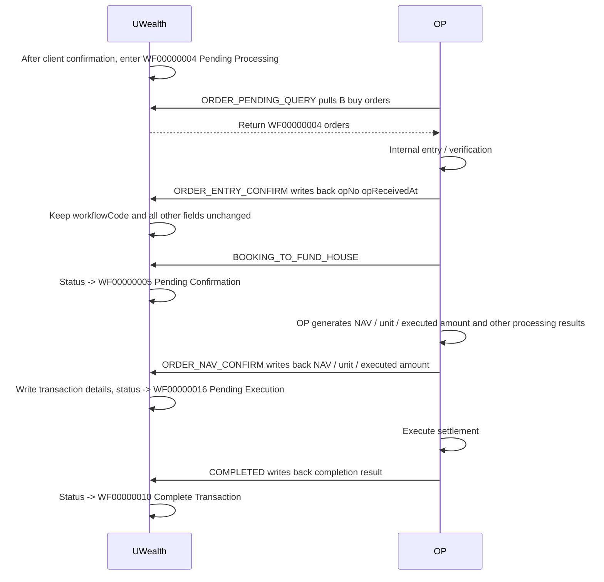
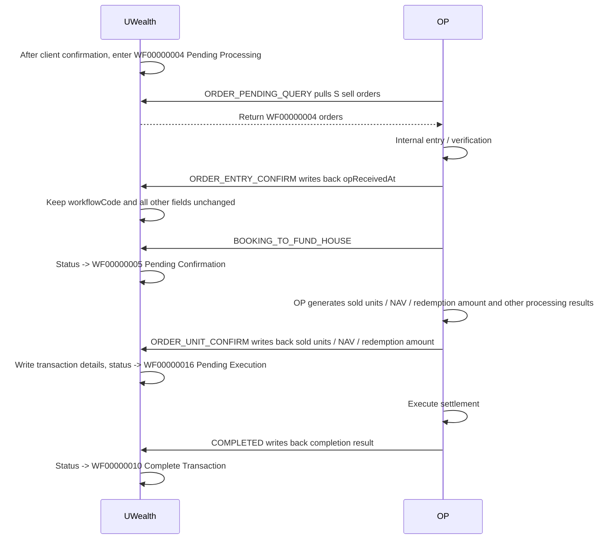
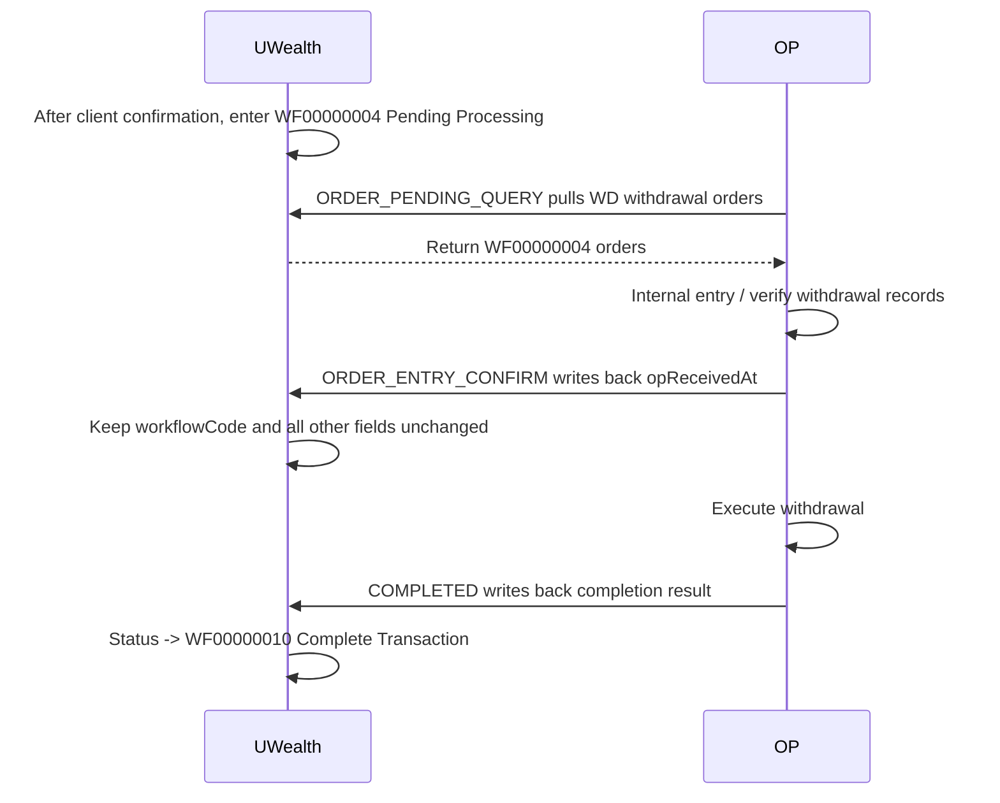
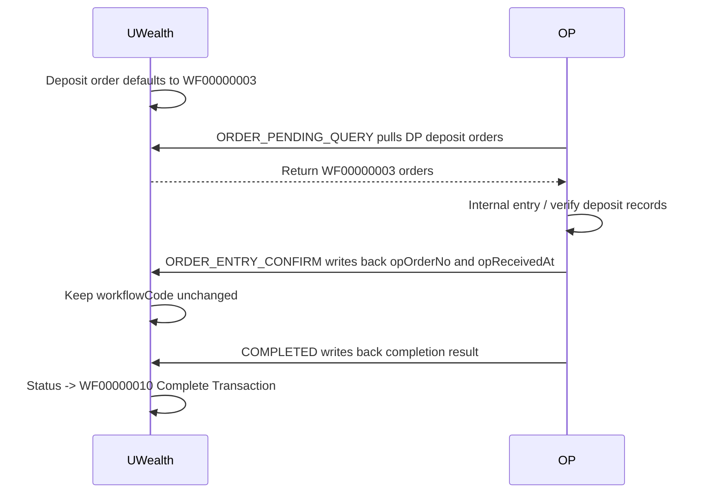

| Date       | Author | Change Description                                           | Version |
| ---------- | ------ | ------------------------------------------------------------ | ------- |
| 2026-08-11 | majie  | Update[Buy flow](#change-buy): `ORDER_ENTRY_CONFIRM` only updates `opReceivedAt` and does not update `workflowCode`; `BOOKING_TO_FUND_HOUSE` advances the order to `WF00000005`. | V2.0    |
| 2026-08-11 | majie  | Update[Sell flow](#change-sell): `ORDER_ENTRY_CONFIRM` only updates `opReceivedAt` and does not update `workflowCode`; `BOOKING_TO_FUND_HOUSE` advances the order to `WF00000005`. | V2.0    |
| 2026-08-11 | majie  | Update[Withdrawal flow](#change-wd): `ORDER_ENTRY_CONFIRM` only updates `opReceivedAt`; `workflowCode` and all other fields remain unchanged. | V2.0    |
| 2026-08-11 | majie  | Update [Deposit flow](#change-dp): deposit orders default to `WF00000003`; `ORDER_ENTRY_CONFIRM` only updates `opReceivedAt`, while `workflowCode` and all other fields remain unchanged. | V2.0    |

# OP System Integration with UWealth Unified API Demo

## Table of Contents

- [1. Document Overview](#1-document-overview)
- [2. API Endpoint](#2-api-endpoint)
- [3. Authentication](#3-authentication)
- [4. Unified Request Format](#4-unified-request-format)
- [5. Unified Response Format](#5-unified-response-format)
- [6. `type` List](#6-type-list)
- [7. Order Type `orderType`](#7-order-type-ordertype)
- [8. Workflow Status Codes](#8-workflow-status-codes)
- [9. Logical API 1: OP Pulls Pending Orders](#9-logical-api-1-op-pulls-pending-orders)
- [10. Logical API 2: OP Entry Confirmation](#10-logical-api-2-op-entry-confirmation)
- [11. Logical API 3: OP NAV Confirmation](#11-logical-api-3-op-nav-confirmation)
- [12. Logical API 4: OP Unit Confirmation](#12-logical-api-4-op-unit-confirmation)
- [13. Logical API 5: OP COMPLETED](#13-logical-api-5-op-completed)
- [14. Logical API 6: OP Rejects Orders](#14-logical-api-6-op-rejects-orders)
- [15. Logical API 7: OP Pushes Transactions](#15-logical-api-7-op-pushes-transactions)
- [16. Idempotency Rules](#16-idempotency-rules)
- [17. Error Code Demo](#17-error-code-demo)
- [18. Notes](#18-notes)
- [19. Items To Be Supplemented](#19-items-to-be-supplemented)

## 1. Document Overview

This document describes the business integration approach for transactions, client information, and related data between the OP system and UWealth.

The OP system calls UWealth through a fixed HTTP URL. Different business actions are distinguished by the `type` field in the request body, and business parameters are placed under the `request` field.

This is a demo version. Fields, error codes, and special business rules still need to be supplemented based on the actual OP payloads.

### 1.1 Communication Flow by `orderType`

The following diagrams show only the major communication points and key status transitions between UWealth and OP. Use the request examples under each logical API as the source of truth for specific fields.

#### B - Buy

<a name="change-buy"></a>




#### S - Sell
<a name="change-sell"></a>



#### WD - Withdrawal
<a name="change-wd"></a>



#### DP - Deposit
<a name="change-dp"></a>



## 2. API Endpoint

### Test Environment

```http
POST http://xxxx/openapi/fund/op/commands
```

### Production Environment

```http
POST http://xxxx/openapi/fund/op/commands
```

## 3. Authentication

[openapi-integration-guide.md](openapi/openapi-integration-guide.md)

## 4. Unified Request Format

```json
{
  "type": "ORDER_ENTRY_CONFIRM",
  "version": "1.0",
  "requestId": "550e8400-e29b-41d4-a716-446655440000",
  "timestamp": 1778121000000,
  "request": {}
}
```

### 4.1 Common Fields

| Field | Type | Required | Description |
| --- | --- | --- | --- |
| `type` | string | Yes | Business action type |
| `version` | string | Yes | API version. Default: `1.0` |
| `requestId` | string | Yes | Request deduplication identifier. It must be globally unique. UUID is recommended. UWealth deduplicates by `requestId`; if the same `requestId` already exists, UWealth responds by skipping duplicate processing. |
| `timestamp` | number | Yes | OP request timestamp in milliseconds |
| `request` | object | Yes | Business parameters. The structure varies by `type`. |

### 4.2 Batch Transaction Rules

Each request is processed as one batch and follows an all-success or all-failure rule. Partial success is not allowed.

When `request` is a collection, UWealth must process all records in the collection within the same transaction. If validation or processing fails for any record, the whole request fails, all processed records must be rolled back, and a failure response must be returned.

## 5. Unified Response Format

UWealth uniformly returns `WealthResult<T>`.

```json
{
  "code": "0",
  "error": null,
  "success": true,
  "data": {}
}
```

### 5.1 Response Fields

| Field | Type | Description |
| --- | --- | --- |
| `code` | string | Return code. `0` indicates success; any non-`0` value indicates failure. |
| `error` | string | Error message. It is `null` on success. |
| `success` | boolean | Whether the overall request succeeded. In batch APIs, this does not represent per-record status. |
| `data` | object | Business response data. Non-paginated APIs return the business object or result collection directly; paginated APIs return a pagination object. |

### 5.2 Non-Paginated Success Response Example

For non-paginated APIs, `data` is the business return value directly. It is not additionally wrapped with `type`, `requestId`, or `result`.

```json
{
  "code": "0",
  "error": null,
  "success": true,
  "data": {
    "uwOrderNo": "OD251230150042173191",
    "opOrderNo": "OPORD202605070001",
    "workflowCode": "WF00000005"
  }
}
```

### 5.3 Paginated Success Response Example

For paginated APIs, `data` is a pagination object containing `totalCount` and `page`.

```json
{
  "code": "0",
  "error": null,
  "success": true,
  "data": {
    "totalCount": 9224,
    "page": [
      {
        "uwOrderNo": "OD251230150042173191",
        "orderType": "B",
        "workflowCode": "WF00000004",
        "clientCode": "C0001",
        "fundCode": "FUND001",
        "currency": "MYR",
        "amount": 1000.00
      }
    ]
  }
}
```

### 5.4 Failure Response Example

When a request fails, `data` is usually empty. Whether business context is returned depends on the API implementation. A failed batch API means the entire request failed; some records cannot succeed while other records fail.

```json
{
  "code": "0200203",
  "error": "OP order number mismatch",
  "success": false,
  "data": null
}
```

## 6. `type` List

| type | Direction | Description |
| --- | --- | --- |
| `ORDER_PENDING_QUERY` | OP -> UWealth | OP pulls pending orders |
| `ORDER_ENTRY_CONFIRM` | OP -> UWealth | OP entry confirmation |
| `ORDER_NAV_CONFIRM` | OP -> UWealth | OP confirms buy NAV / unit / executed amount |
| `ORDER_UNIT_CONFIRM` | OP -> UWealth | OP confirms sell units / NAV / redemption amount |
| `COMPLETED` | OP -> UWealth | OP writes back final completion and advances the order to `WF00000010` |
| `ORDER_REJECT` | OP -> UWealth | OP rejects an order |
| `OP_TRANSACTION_PUSH` | OP -> UWealth | OP actively pushes transactions, such as dividend, unit split, and interest |
| `CLIENT_ONBOARDING` | OP -> UWealth | Synchronize client onboarding information |
| `CLIENT_UPDATE` | OP -> UWealth | Update client information |

## 7. Order Type `orderType`

| orderType | Description | Typical Flow |
| --- | --- | --- |
| `B` | Buy | WF02 -> WF04 -> WF05 -> WF16 -> WF10 |
| `S` | Sell | WF02 -> WF04 -> WF05 -> WF16 -> WF10 |
| `SW` | Switch | WF02 -> WF06 -> WF28 -> WF17 -> WF18 -> WF10 |
| `TI` | Transfer In | WF04 -> WF05 -> WF10 |
| `TO` | Transfer Out | WF04 -> WF05 -> WF10 |
| `DP` | Deposit | FPX / Cheque / Online Banking |
| `WD` | Withdrawal | WF02 -> WF04 -> WF05 -> WF10 |
| `DV` | Dividend | Written directly by OP, complete at WF10 |
| `US` | Unit Split | Written directly by OP, complete at WF10 |
| `DN` | Debit Note | WF19 -> WF10 |
| `CN` | Credit Note refund / adjustment | Written directly by OP, complete at WF10 |
| `FS` | Force Sell | WF04 -> WF05 -> WF16 -> WF10 |
| `IN` | Interest credit | Written directly by OP, complete at WF10 |
| `RSP` | Regular savings plan | Setup and execution follow different flows |

## 8. Workflow Status Codes

| workflowCode | Description |
| --- | --- |
| `WF00000002` | Pending Client Approval |
| `WF00000004` | Pending Processing, waiting for OP processing |
| `WF00000005` | Pending Confirmation |
| `WF00000016` | Pending Execution |
| `WF00000010` | Complete Transaction |
| `WF00000015` | Admin Reject |
| `WF00000019` | Partially Paid, used by Debit Note |

## 9. Logical API 1: OP Pulls Pending Orders

### 9.1 type

`ORDER_PENDING_QUERY`

### 9.2 Description

The OP system pulls orders waiting for OP processing from UWealth. By default, UWealth returns all orders waiting to be pulled by OP.

**`orderTypes` is an optional filter. If it is omitted, `null`, or an empty array**, it means all orders waiting to be pulled by OP should be returned.

Note: Deposit orders with `orderType=DP` and payment method `FPX` must be excluded. The specific filter field is to be supplemented.

### 9.3 Request Example

```json
{
  "type": "ORDER_PENDING_QUERY",
  "version": "1.0",
  "requestId": "550e8400-e29b-41d4-a716-446655440001",
  "timestamp": 1778121000000,
  "request": {
    "orderTypes": ["B", "S", "DP", "WD", "SW", "TI", "TO", "FS"],
    "pageSize": 1000
  }
}
```

### 9.4 Response Example

```json
{
  "code": "0",
  "error": null,
  "success": true,
  "data": {
    "totalCount": 4,
    "page": [
      {
        "uwOrderNo": "OD260406102449381037",
        "orderType": "B",
        "workflowCode": "WF00000004",
        "accountCode": "S02005WW",
        "tradeDate": "2026-04-06 10:24:49.387",
        "trnCode": "UP",
        "stockCode": "F0000170SY",
        "amount": 15000,
        "unit": 0,
        "salesChargeRate": 0,
        "salesChargeAmount": 0,
        "otherFee": 0,
        "orderNo": "OD260406102449381037",
        "orderCurr": "MYR",
        "orderExRate": 1,
        "amountSC": 15000,
        "mode": "ONLINE",
        "remark": "",
        "taxAmount": 0
      },
      {
        "uwOrderNo": "OD260408105203588491",
        "orderType": "S",
        "workflowCode": "WF00000004",
        "accountCode": "L01129WWN",
        "tradeDate": "2026-04-08 10:52:03.593",
        "trnCode": "US",
        "stockCode": "F00001J6AB",
        "amount": 0,
        "unit": "24925.39",
        "salesChargeRate": 0,
        "salesChargeAmount": "0",
        "otherFee": "0",
        "orderNo": "OD260408105203588491",
        "orderCurr": 0,
        "orderExRate": 1,
        "amountSC": 0,
        "mode": "ONLINE",
        "remark": "",
        "taxAmount": "0"
      },
      {
        "uwOrderNo": "OD260410125537104695",
        "orderType": "DP",
        "workflowCode": "WF00000004",
        "accountCode": "C02806WW",
        "depositDate": "2026-04-10 12:55:37.107",
        "depositMethod": "105",
        "bankAccount": "27",
        "currency": "MYR",
        "amount": 30000,
        "salesChargeRate": "2.00",
        "salesChargeAmount": 587.31,
        "otherFee": "0",
        "orderNo": "OD260410125537104695",
        "taxAmount": "46.99"
      },
      {
        "uwOrderNo": "OD260410130307112334",
        "orderType": "WD",
        "workflowCode": "WF00000004",
        "accountCode": "K02028WWN",
        "notificationDate": "2026-04-10 13:03:07.113",
        "wdlType": "P",
        "withdrawCurrency": "MYR",
        "currency": "MYR",
        "amount": 20000,
        "orderNo": "OD260410130307112334"
      }
    ]
  }
}
```

## 10. Logical API 2: OP Entry Confirmation

### 10.1 type

`ORDER_ENTRY_CONFIRM`

### 10.2 Description

After OP completes internal entry, it writes back the OP order number. UWealth advances the order from `WF00000004` to `WF00000005`. `request` is a collection and supports submitting multiple orders at once.

### 10.3 Request Example

```json
{
  "type": "ORDER_ENTRY_CONFIRM",
  "version": "1.0",
  "requestId": "550e8400-e29b-41d4-a716-446655440002",
  "timestamp": 1778121300000,
  "request": [
    {
      "uwOrderNo": "OD260406102449381037",
      "opOrderNo": "OP260406102449381037",
      "operator": "OP001",
      "confirmedAt": "2026-05-07T10:35:00+08:00",
      "success": "true"
    }
  ]
}
```

### 10.4 Response Example

```json
{
  "code": "0",
  "error": null,
  "success": true,
  "data": [
    {
      "uwOrderNo": "OD260406102449381037",
      "opOrderNo": "OP260406102449381037",
      "success": "true"
    }
  ]
}
```

### 10.5 Status After Success

`WF00000005`

## 11. Logical API 3: OP NAV Confirmation

### 11.1 type

`ORDER_NAV_CONFIRM`

### 11.2 Description

OP writes back the NAV, unit, executed amount, and other information for buy orders. UWealth writes transaction details and advances the order to `WF00000016`. `request` is a collection and supports submitting multiple orders at once.

### 11.3 Request Example

```json
{
  "type": "ORDER_NAV_CONFIRM",
  "version": "1.0",
  "requestId": "550e8400-e29b-41d4-a716-446655440003",
  "timestamp": 1778139000000,
  "request": [
    {
      "opPkId": "UTF*260400402",
      "uwOrderNo": "OD260406102449381037",
      "clientCode": "S02005WW",
      "unit": 21346.24,
      "nav": 0.7027,
      "branch": "S51",
      "grossAmount": -15000,
      "netAmount": -15000,
      "mGrossAmount": -15000,
      "mNetAmount": -15000,
      "saleChargeAmount": 0,
      "saleChargeRate": 0,
      "currency": "MYR",
      "currencyRate": 1,
      "fundId": "F0000170SY",
      "fundAmount": -15000,
      "fundMAmount": -15000,
      "type": null,
      "status": 1,
      "ipAddress": "169.254.1.2"
    }
  ]
}
```

### 11.4 Response Example

```json
{
  "code": "0",
  "error": null,
  "success": true,
  "data": [
    {
      "uwOrderNo": "OD260406102449381037",
      "opOrderNo": "UTF*260400402",
      "success": "true"
    }
  ]
}
```

### 11.5 Status After Success

`WF00000016`

## 12. Logical API 4: OP Unit Confirmation

### 12.1 type

`ORDER_UNIT_CONFIRM`

### 12.2 Description

OP writes back the executed units, NAV, redemption amount, and other information for sell orders. UWealth writes transaction details and advances the order to `WF00000016`. `request` is a collection and supports submitting multiple orders at once.

### 12.3 Request Example

```json
{
  "type": "ORDER_UNIT_CONFIRM",
  "version": "1.0",
  "requestId": "550e8400-e29b-41d4-a716-446655440004",
  "timestamp": 1778139000000,
  "request": [
    {
      "opPkId": "UTF*260400904",
      "uwOrderNo": "OD260408105203588491",
      "clientCode": "L01129WWN",
      "unit": 24925.39,
      "nav": 0.7842,
      "branch": "002",
      "grossAmount": 19546.49,
      "netAmount": 19546.49,
      "mGrossAmount": 19546.49,
      "mNetAmount": 19546.49,
      "saleChargeAmount": 0,
      "saleChargeRate": 0,
      "currency": "MYR",
      "currencyRate": 1,
      "fundId": "F00001J6AB",
      "fundAmount": 0,
      "fundMAmount": 0,
      "type": "S",
      "status": 1,
      "ipAddress": "169.254.1.2"
    }
  ]
}
```

### 12.4 Response Example

```json
{
  "code": "0",
  "error": null,
  "success": true,
  "data": [
    {
      "uwOrderNo": "OD260408105203588491",
      "opOrderNo": "UTF*260400904",
      "success": "true"
    }
  ]
}
```

### 12.5 Status After Success

`WF00000016`

## 13. Logical API 5: OP COMPLETED

### 13.1 type

`COMPLETED`

### 13.2 Description

Used by OP to write back the final completion status and advance the order to `WF00000010` Complete Transaction. `request` is a collection and supports submitting multiple orders at once.

### 13.3 Request Example

```json
{
  "type": "COMPLETED",
  "version": "1.0",
  "requestId": "550e8400-e29b-41d4-a716-446655440005",
  "timestamp": 1778126400000,
  "request": [
    {
      "orderType": "B",
      "uwOrderNo": "OD260406102449381037",
      "clientCode": "S02005WW",
      "workflowCode": "WF00000010",
      "ipAddress": "169.254.1.2"
    },
    {
      "orderType": "S",
      "uwOrderNo": "OD260408105203588491",
      "clientCode": "L01129WWN",
      "workflowCode": "WF00000010",
      "ipAddress": "169.254.1.2"
    },
    {
      "orderType": "DP",
      "opPkId": "CSH*260400251",
      "uwOrderNo": "OD260410125537104695",
      "clientCode": "C02806WW",
      "branch": "004",
      "netAmount": 29365.7,
      "grossAmount": 30000,
      "mNetAmount": 29365.7,
      "mGrossAmount": 30000,
      "currency": "MYR",
      "currencyRate": "1",
      "status": 1,
      "ipAddress": "169.254.1.2"
    },
    {
      "orderType": "WD",
      "opPkId": "SEC*260400108",
      "uwOrderNo": "OD260410130307112334",
      "clientCode": "K02028WWN",
      "branch": "S51",
      "netAmount": -20000,
      "grossAmount": -20000,
      "mNetAmount": -20000,
      "mGrossAmount": 0,
      "currency": "MYR",
      "currencyRate": "1",
      "status": 1,
      "ipAddress": "169.254.1.2"
    }
  ]
}
```

### 13.4 Response Example

```json
{
  "code": "0",
  "error": null,
  "success": true,
  "data": [
    {
      "uwOrderNo": "OD260406102449381037",
      "opOrderNo": "UTF*260400402",
      "success": "true"
    }
  ]
}
```

### 13.5 Status After Success

`WF00000010`

## 14. Logical API 6: OP Rejects Orders

### 14.1 type

`ORDER_REJECT`

### 14.2 Description

OP rejects orders, and UWealth updates the orders to a rejected status based on business rules. `request` is a collection and supports submitting multiple orders at once.

### 14.3 Request Example

```json
{
  "type": "ORDER_REJECT",
  "version": "1.0",
  "requestId": "550e8400-e29b-41d4-a716-446655440006",
  "timestamp": 1778122800000,
  "request": [
    {
      "uwOrderNo": "OD251230150042173191",
      "opOrderNo": "OPORD202605070001",
      "reason": "Invalid fund account",
      "operator": "OP001"
    }
  ]
}
```

### 14.4 Response Example

```json
{
  "code": "0",
  "error": null,
  "success": true,
  "data": [
    {
      "uwOrderNo": "OD251230150042173191",
      "opOrderNo": "OPORD202605070001",
      "success": "true"
    }
  ]
}
```

## 15. Logical API 7: OP Pushes Transactions

### 15.1 type

`OP_TRANSACTION_PUSH`

### 15.2 Description

Used by OP to actively push transactions generated on the OP side to UWealth, such as Dividend, Unit Split, Credit Note, and Interest. These transactions are not generated by the UWealth order pull flow; they are initiated by OP and synchronized to UWealth.

| orderType | Description |
| --- | --- |
| `DV` | Dividend |
| `US` | Unit Split |
| `CN` | Credit Note refund / adjustment |
| `IN` | Interest credit |

The specific `request` fields are to be supplemented. `request` is a collection and supports submitting multiple OP-pushed transactions at once.

### 15.3 Request Example

```json
{
  "type": "OP_TRANSACTION_PUSH",
  "version": "1.0",
  "requestId": "550e8400-e29b-41d4-a716-446655440007",
  "timestamp": 1778126400000,
  "request": [
    {

    }
  ]
}
```

### 15.4 Response Example

```json
{
  "code": "0",
  "error": null,
  "success": true,
  "data": [
    {
      "uwOrderNo": "OD260507100000000001",
      "opOrderNo": "OP260507100000000001",
      "success": "true"
    }
  ]
}
```

## 16. Idempotency Rules

UWealth performs idempotency checks based on the following fields:

| Field | Description |
| --- | --- |
| `requestId` | Request deduplication identifier. It must be globally unique. UUID is recommended. |
| `type` | Business action |
| `uwOrderNo` | UWealth order number. Participates in validation when present. |
| `opOrderNo` | OP order number. Participates in validation when present. |

UWealth deduplicates by `requestId`. If the same `requestId` already exists, the system responds by skipping duplicate processing and does not execute subsequent business actions.

The idempotency granularity of a batch request is the entire request batch. When the same `requestId` is retried, the same overall processing result for that batch must be returned. Only replaying or compensating part of the records is not allowed.

## 17. Error Code Demo

| code | error | Description |
| --- | --- | --- |
| `0` | `null` | Success |
| `openapi.sign.verify.fail` | Signature verification failed | Signature verification failed |
| `0200203` | OP order number mismatch | OP order number mismatch |
| `0200204` | Invalid workflow status | The current workflow status does not allow this operation |
| `0200205` | Order not found | Order does not exist |
| `0200206` | Duplicate request | Duplicate request |
| `0200207` | Unsupported command type | Unsupported `type` |

## 18. Notes

1. OP integration uses only one fixed URL, but each `type` is treated as an independent logical API.
2. The `request` field must follow different field rules depending on `type`.
3. `type`, `version`, and `requestId` are required.
4. Batch requests must fully succeed or fully fail. If any record fails, the entire request fails and rolls back.
5. The per-record `success` value in a successful response `data` only represents result details within a successful batch. It does not mean partial success is supported.
6. After a transaction status changes, UWealth needs to notify the client. The specific notification method is to be supplemented.
7. When OP pulls pending orders, deposit orders of the FPX type must be excluded. The specific filter field is to be supplemented.
8. Orders such as `B`, `S`, `SW`, and `FS` usually follow the OP pull `WF00000004` mode.
9. OP-pushed transactions such as `DV`, `US`, `CN`, and `IN` require separate field definitions.
10. `DP`, `DN`, and `RSP` are special flows. It is recommended to supplement them later in separate sections.

## 19. Items To Be Supplemented

| Item | Description |
| --- | --- |
| Actual OP fields | Actual `request` fields for each `type` |
| OP error codes | Error codes returned by OP or exposed by UWealth to OP |
| DP deposit rules | Differences among FPX, Cheque, and Online Banking |
| DN debit note rules | Debit Note partial payment, debit date, and status transition rules |
| RSP regular savings plan rules | Three-stage flow for setup, authorization, and execution |
| Notification rules | Rules for notifying client / advisor after status changes |
| Idempotency persistence rules | Unique constraints for requestId, type, and orderNo |
