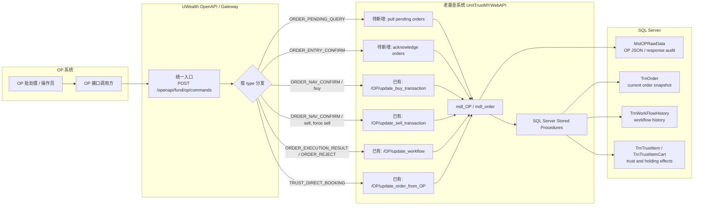
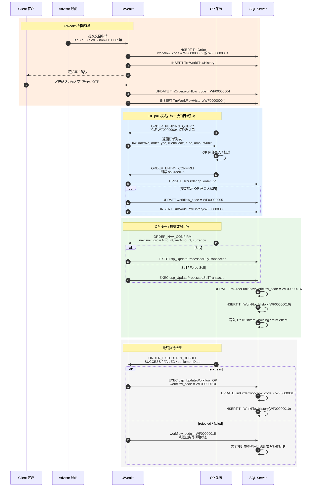
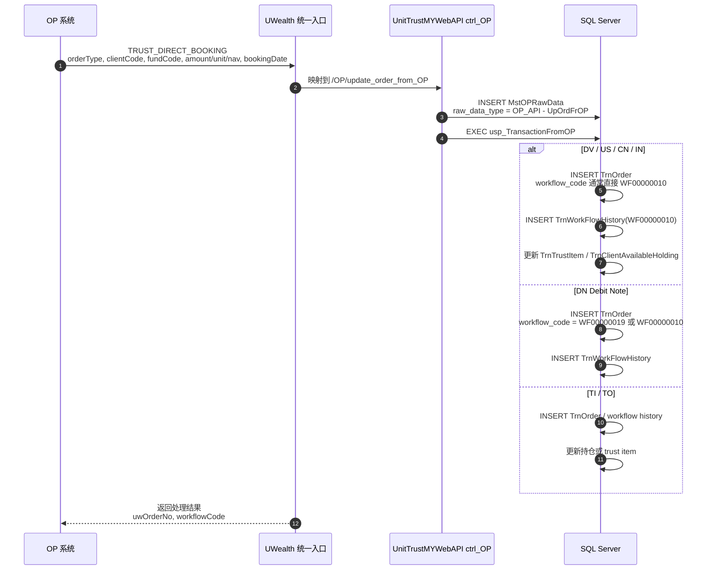
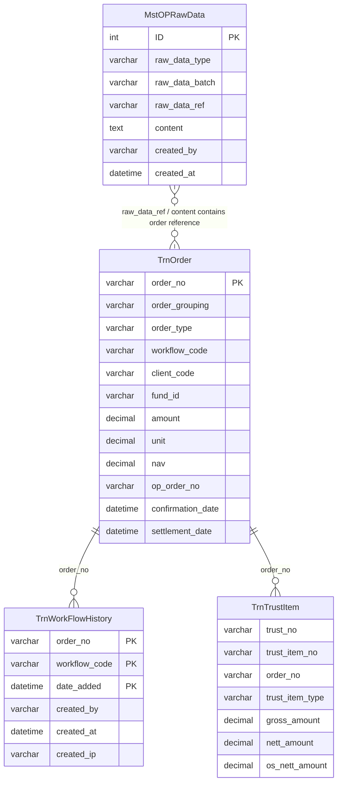

# OP 对接 UWealth 统一接口流程图

## 1. 依据与范围

本文档用于把 OP 系统与 UWealth 基金交易系统的对接关系画清楚，重点覆盖：

- OP 统一入口 `type` 与老系统 `OP/*` 接口、SQL Server 存储过程、核心表的映射。
- 普通交易订单从 UWealth 创建、客户确认、OP 处理、NAV 回写、最终完成的主路径。
- OP 主动发起的直接入账类交易，例如 `DV`、`US`、`CN`、`IN`、`DN`、`TI`、`TO`。
- 审计落点：`MstOPRawData` 记录 OP/交易原始报文，`TrnOrder` 保存订单当前快照，`TrnWorkFlowHistory` 保存状态历史。

参考来源：

| 来源 | 作用 |
| --- | --- |
| `uw2--/op/OP系统对接UWealth统一接口Demo.md` | 统一接口 `type`、请求/响应和拟定业务动作 |
| `wealth-doc/architecture/prd/trust-worflow.md` | 各 `order_type` 的交易路径和工作流说明 |
| `UnitTrustMYWebAPI/UnitTrustMYWebAPI/docs/op-buy-sell-transaction-api.md` | 老系统 OP 买卖接口、现状差异和遗漏检查 |
| `UnitTrustMYWebAPI/UnitTrustMYWebAPI/docs/op-business-transaction-api-list.md` | OP 交易接口清单草案 |
| MSSQL `TrnOrder`、`TrnWorkFlowHistory`、`MstOPRawData` | 表结构、记录量和真实报文审计类型 |

> 说明：老系统当前已有 OP 回调接口和 UW 主动调用 OP 的路径；`OP pull pending orders` 与 `OP acknowledge orders` 在老系统文档中标注为待新增。如果新 UWealth 采用统一接口，应以“OP 通过统一入口按 `type` 拉取/回写”为目标形态，同时兼容老系统接口语义。

## 2. 总览图

## 3. 普通订单主流程图

适用订单类型：`B` Buy、`S` Sell、`FS` Force Sell；`DP`、`WD`、`TI`、`TO` 可复用部分步骤，但有各自特殊规则。`DP` 的 FPX 入金不进入 OP pull 范围。

### 主路径状态

| 阶段 | 统一接口 type | 老系统现状接口 / 逻辑 | 关键表落点 |
| --- | --- | --- | --- |
| 客户确认后待 OP 处理 | `ORDER_PENDING_QUERY` | 老系统待新增 pull；历史上也存在 UW 主动调用 OP `TransactionUnitTrust` | `TrnOrder.workflow_code = WF00000004` |
| OP 录入确认 | `ORDER_ENTRY_CONFIRM` | 老系统待新增 ACK；当前可只写 `op_order_no`，是否写 `WF00000005` 需业务确认 | `TrnOrder.op_order_no`，可选 `TrnWorkFlowHistory(WF00000005)` |
| OP NAV / unit 确认 | `ORDER_NAV_CONFIRM` | `/OP/update_buy_transaction`、`/OP/update_sell_transaction` | `TrnOrder.unit/nav`，`TrnWorkFlowHistory(WF00000016)`，`TrnTrustItem` |
| OP 最终完成 | `ORDER_EXECUTION_RESULT` | `/OP/update_workflow` -> `usp_UpdateWorkflow_OP` | `TrnOrder.workflow_code = WF00000010`，`TrnWorkFlowHistory(WF00000010)` |
| OP 拒绝 | `ORDER_REJECT` | `/OP/update_workflow` 或 NAV 回调 `status != 1` | `WF00000015`，部分订单需回滚 `TrnOrderPayment` / `TrnTrustItemCart` |

## 4. OP 直接入账类交易图

适用订单类型：`DV` Dividend、`US` Unit Split、`CN` Credit Note、`IN` Interest，以及部分 `TI` / `TO` / `DN` 由 OP 主动生成的场景。

## 5. 数据落点图

### 表职责

| 表 | 职责 | MSSQL 确认点 |
| --- | --- | --- |
| `TrnOrder` | 订单当前状态和交易核心字段。`workflow_code` 是当前状态，`op_order_no` 保存 OP 单号。 | 表约 386,655 笔；主键 `order_no`；有 `IX_TrnOrder_workflow_code` |
| `TrnWorkFlowHistory` | 工作流变更流水。每次状态推进应写入一条历史。 | 表约 1,965,382 笔；主键为 `order_no + workflow_code + date_added` |
| `MstOPRawData` | OP 原始 JSON、UW 发送 OP 的交易报文和 OP 响应审计。 | 表约 508,214 笔；主要类型包括 `OP_API - WF`、`OP_API - UpOrdFrOP`、`OP_API - B/S/SW/DP/WD` |
| `TrnTrustItem` / `TrnTrustItemCart` | 资金/持仓账本影响。Buy、Sell、Direct Booking 会按类型写入或更新。 | `tr_UpdTrnTrust` 会从 `TrnTrustItem` 汇总到 `TrnTrust` |

## 6. 统一 type 到老系统映射

| 统一 type | 方向 | 订单类型 | 老系统 endpoint / SP | 说明 |
| --- | --- | --- | --- | --- |
| `ORDER_PENDING_QUERY` | OP -> UW | `B/S/SW/DP/WD/TI/TO/FS` | 待新增；查询 `TrnOrder.workflow_code = WF00000004` | `DP` 需排除 FPX |
| `ORDER_ENTRY_CONFIRM` | OP -> UW | 常规 OP 处理订单 | 待新增；更新 `TrnOrder.op_order_no` | 是否同步写 `WF00000005` 需业务确认 |
| `ORDER_NAV_CONFIRM` | OP -> UW | `B` | `/OP/update_buy_transaction` -> `usp_UpdateProcessedBuyTransaction` | 成功推进 `WF00000016` |
| `ORDER_NAV_CONFIRM` | OP -> UW | `S/FS` | `/OP/update_sell_transaction` -> `usp_UpdateProcessedSellTransaction` | 成功推进 `WF00000016` |
| `ORDER_EXECUTION_RESULT` | OP -> UW | 常规订单 | `/OP/update_workflow` -> `usp_UpdateWorkflow_OP` | 成功推进 `WF00000010` |
| `ORDER_REJECT` | OP -> UW | 常规订单 | `/OP/update_workflow` 或 NAV 回调失败 | 通常 `WF00000015`，并按订单类型处理回滚 |
| `TRUST_DIRECT_BOOKING` | OP -> UW | `DV/US/CN/IN/DN/TI/TO` | `/OP/update_order_from_OP` -> `usp_TransactionFromOP` | OP 主动写入订单、workflow、trust/holding |

## 7. 工作流速查

| Code | 含义 | OP 对接中的位置 |
| --- | --- | --- |
| `WF00000002` | Pending Client Approval | 顾问代客提交后，等待客户确认 |
| `WF00000004` | Pending Processing | 客户确认后，等待 OP pull / OP 处理 |
| `WF00000005` | Pending Confirmation | OP 已录入，等待 NAV / 成交确认；老代码常量不完整，是否使用需确认 |
| `WF00000016` | Pending Execution | OP NAV / unit 回写成功，等待最终结算完成 |
| `WF00000010` | Complete Transaction | 交易完成 |
| `WF00000015` | Admin / OP Reject | OP 拒绝或成交回写失败 |
| `WF00000019` | Partially Paid | Debit Note 部分付款场景 |

## 8. 落地建议

1. 新统一接口只暴露一个入口，但服务内部按 `type` 映射到不同 command handler。
2. 对普通订单，先实现最小闭环：`ORDER_PENDING_QUERY -> ORDER_ENTRY_CONFIRM -> ORDER_NAV_CONFIRM -> ORDER_EXECUTION_RESULT`。
3. `MstOPRawData` 必须在每次 OP 请求进入时落审计，建议 `raw_data_type` 使用统一命名，例如 `OP_API - ORDER_NAV_CONFIRM`，同时保留老系统类型兼容映射。
4. `WF00000005` 不要默认强推。若前端、报表、运营需要“OP 已录入待确认”状态，再补常量、描述、查询和历史迁移策略；否则只写 `op_order_no`，订单停在 `WF00000004` 到 NAV 回写。
5. 所有状态推进必须同时更新 `TrnOrder.workflow_code` 和插入 `TrnWorkFlowHistory`，否则后续对账会只能看到当前态，看不到 OP 处理链路。
6. OP pull 查询要具备幂等和游标分页能力，避免 OP 重复拉取导致重复处理；最终幂等键建议包含 `requestId + type + uwOrderNo + opOrderNo`。
