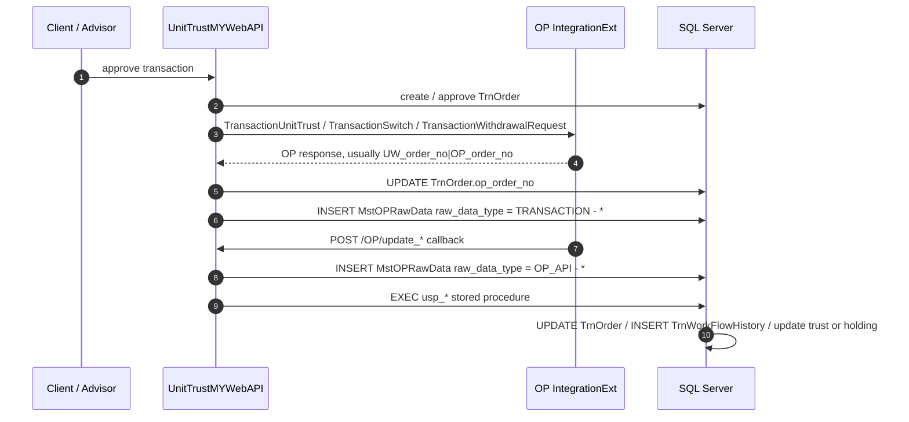

# OP 老系统接口实现说明

## 1. 文档说明

本文只描述老代码真实实现，不按新的统一接口设想整理。

代码来源：

| 模块 | 文件 |
| --- | --- |
| API 路由 | `UnitTrustMYWebAPI/UnitTrustMYWebAPI/application/config/routes.php` |
| API OP Controller | `UnitTrustMYWebAPI/UnitTrustMYWebAPI/application/controllers/ctrl_OP.php` |
| API OP Model | `UnitTrustMYWebAPI/UnitTrustMYWebAPI/application/models/mdl_OP.php` |
| API 对外调用 OP | `UnitTrustMYWebAPI/UnitTrustMYWebAPI/application/models/mdl_order.php` |
| Mobile 对外调用 OP | `UnitTrustMYWebAPI/UnitTrustMYWebAPI/application/models/mdl_mobile.php` |
| WebApp OP Wrapper | `UnitTrustMYWebApp/UnitTrustMYWebApp/application/modules/OP/controllers/ctrl_OP.php` |
| OP URL 配置 | `UnitTrustMYWebAPI/UnitTrustMYWebAPI/application/config/config.php` |
| 数据库 | `MstOPRawData`、`TrnOrder`、`TrnWorkFlowHistory`、相关 `usp_*` 存储过程 |

## 2. 老系统真实集成形态

老系统不是一个统一 `type` 入口，而是两类接口并存：

1. UW 主动调用 OP：客户确认订单后，UW 调用 OP 的 `IntegrationExt/*` URL，把订单送到 OP，并把 OP 返回的单号写回 `TrnOrder.op_order_no`。
2. OP 回调 UW：OP 完成 NAV、unit、workflow 或直接入账后，调用 UW 的 `/OP/*` URL，UW 写 `MstOPRawData`，再执行 SQL Server 存储过程更新订单、工作流、trust 和 holding。



## 3. 请求体外层格式

### 3.1 UnitTrustMYWebAPI 的 `/OP/*` 接口

`ctrl_OP.php` 里所有 OP 回调都调用：

```php
$json = $this->getPostJson();
```

`MY_Controller::getPostJson()` 实际返回：

```php
return $this->getPost()['data'];
```

所以 API 项目真实读取的逻辑请求体是外层 envelope 中的 `data`：

```json
{
  "user": {
    "login_id": "OP",
    "client_code": null
  },
  "ip_address": "10.10.30.212",
  "data": {
    "OP_PK_ID": "UTB260106000001",
    "UW_order_no": "OD260106144812840357"
  }
}
```

### 3.2 UnitTrustMYWebApp 的 `/OP/*` wrapper

WebApp 下的 `modules/OP/controllers/ctrl_OP.php` 直接读取 raw JSON：

```php
$data = $this->input->raw_input_stream;
$data = json_decode($data, true);
```

它调用 WebApp `mdl_OP`，再转发到 API_HOST 的同名 `OP/*` URL。

WebApp wrapper 的响应是字符串：

```json
"Data Passed: {\"OP_PK_ID\":\"UTB260106000001\"}"
```

如果 JSON 解析为空：

```json
"Data Passed: null"
```

### 3.3 API 回调响应

API 项目的 `ctrl_OP.php` 大多数方法没有调用 `renderJson()`，也没有显式输出 response。正常情况下通常是 HTTP 200 空响应；如果 PHP 或 DB 报错，则按框架错误处理。

例外：`/OP/get_client_wrap_fee` 会 `renderJson($status, $data)`。

## 4. UW 主动调用 OP 的 URL

配置在 `UnitTrustMYWebAPI/application/config/config.php`：

| 业务 | OP URL |
| --- | --- |
| Cash Deposit `DP` | `http://10.10.20.100:8080/api/IntegrationExt/TransactionCashDeposit` |
| Buy `B` | `http://10.10.20.100:8080/api/IntegrationExt/TransactionUnitTrust` |
| Sell `S` | `http://10.10.20.100:8080/api/IntegrationExt/TransactionUnitTrust` |
| Withdrawal `WD` | `http://10.10.20.100:8080/api/IntegrationExt/TransactionWithdrawalRequest` |
| Switch `SW` | `http://10.10.20.100:8080/api/IntegrationExt/TransactionSwitch` |
| Deposit Support Doc | `http://10.10.20.100:8080/api/IntegrationExt/TransactionCashDeposit_SupportDocByTranID` |
| Client email/mobile update | `http://10.10.20.100:8080/api/IntegrationExt/UpdateClientEmailMobile` |
| Monthly wrap fee | `http://10.10.20.100:8080/api/IntegrationExt/GetAccountMonthlyWrapFee` |
| Unrealised interest | `http://10.10.20.100:8080/api/IntegrationExt/GetAccountUnrealisedInterest` |
| Unrealised wrap fee | `http://10.10.20.100:8080/api/IntegrationExt/GetAccountUnrealisedWrapFee` |

调用方法：`MY_Model::request_OP()`，固定 `POST`，`Content-Type: application/json`，body 为 `json_encode($postData)`。

## 5. UW -> OP：送单接口

### 5.1 Cash Deposit

URL:

```http
POST http://10.10.20.100:8080/api/IntegrationExt/TransactionCashDeposit
```

老代码位置：`mdl_order::riskk_OP_transaction()`

Request:

```json
{
  "accountCode": "A000001WWN",
  "depositDate": "2026-01-06 14:48:12",
  "depositMethod": "103",
  "bankAccount": "BANK",
  "currency": "MYR",
  "amount": 1000.00,
  "salesChargeRate": 0,
  "salesChargeAmount": 0,
  "otherFee": "0",
  "orderNo": "OD260106144812840357",
  "taxAmount": 0
}
```

字段规则：

| 字段 | 老代码来源 |
| --- | --- |
| `accountCode` | `MstClntPrd2.client_code_old` 反查到 OP 口径 client code |
| `depositMethod` | Cheque = `103`，Online Banking = `105` |
| `orderNo` | `TrnOrder.order_no` |
| `taxAmount` | sales charge SST |

Response 处理：

- 老代码只判断 response 不为空、不包含 `error`、并且包含 `OD`。
- 成功响应通常被当成 `UW订单号|OP订单号`。
- 调用后写 `MstOPRawData.raw_data_type = TRANSACTION - DP`。

### 5.2 Buy / Sell Unit Trust

URL:

```http
POST http://10.10.20.100:8080/api/IntegrationExt/TransactionUnitTrust
```

老代码位置：`mdl_order::riskk_OP_transaction()`、`mdl_mobile::CreateObject()`

Buy Request:

```json
{
  "accountCode": "A000001WWN",
  "tradeDate": "2026-01-06 14:48:12",
  "trnCode": "UP",
  "stockCode": "FUND001",
  "amount": 1000.00,
  "unit": "0",
  "salesChargeRate": 1.5,
  "salesChargeAmount": 15.00,
  "otherFee": "0",
  "orderNo": "OD260106144812840357",
  "OrderCurr": "MYR",
  "OrderExRate": 1.00000,
  "AmountSC": 1000.00,
  "mode": "ONLINE",
  "remark": "",
  "taxAmount": 1.20
}
```

Sell Request:

```json
{
  "accountCode": "A000001WWN",
  "tradeDate": "2026-01-06 14:48:12",
  "trnCode": "US",
  "stockCode": "FUND001",
  "amount": 1000.00,
  "unit": 123.45,
  "salesChargeRate": 0,
  "salesChargeAmount": 0,
  "otherFee": "0",
  "orderNo": "OD260106144812840357",
  "OrderCurr": 0,
  "OrderExRate": 1,
  "AmountSC": 0,
  "mode": "ONLINE",
  "remark": "",
  "taxAmount": 0
}
```

字段规则：

| 字段 | Buy | Sell |
| --- | --- | --- |
| `trnCode` | `UP` | `US` |
| `unit` | `0` | `TrnOrder.unit` 或 PRS unit |
| `OrderCurr` | payment currency | `0` |
| `OrderExRate` | `TrnOrder.curr_rate` | `1` |
| `AmountSC` | fund amount / wrap 时为 net amount | `0` |
| `mode` | login id 以 `UTOPS_` 开头为 `OFFLINE`，否则 `ONLINE` | 同左 |

PRS / EPF account code 规则：

| 场景 | OP accountCode |
| --- | --- |
| Normal | 原 OP client code |
| PRS sub account A | 把 `WWN` 去掉后追加 `WP7` |
| PRS sub account B | 把 `WWN` 去掉后追加 `WP3` |
| EPF | 把 `WWN` 去掉后追加 `WE` |

Response 处理：

```text
OD260106144812840357|UTB260106000001
```

老代码用 `explode("|", $response)`：

- 第一段更新匹配 `TrnOrder.order_no`
- 第二段写入 `TrnOrder.op_order_no`
- 发送报文和响应写 `MstOPRawData.raw_data_type = TRANSACTION - B` 或 `TRANSACTION - S`

### 5.3 Withdrawal

URL:

```http
POST http://10.10.20.100:8080/api/IntegrationExt/TransactionWithdrawalRequest
```

Request:

```json
{
  "notificationDate": "2026-01-06 14:48:12",
  "accountCode": "A000001WWN",
  "wdlType": "P",
  "WithdrawCurrency": "MYR",
  "Currency": "MYR",
  "amount": 1000.00,
  "orderNo": "OD260106144812840357"
}
```

说明：

- `mdl_order` 里字段是 `Currency`。
- `mdl_mobile::CreateObject()` 里字段是小写 `currency`。
- 老代码实际存在大小写不一致，需要按调用路径确认 OP 接收端是否兼容。

Response 处理：

- 与 Buy/Sell 类似，期望 response 包含 `OD` 且不包含 `error`。
- 写 `MstOPRawData.raw_data_type = TRANSACTION - WD`。

### 5.4 Switch

URL:

```http
POST http://10.10.20.100:8080/api/IntegrationExt/TransactionSwitch
```

Request:

```json
{
  "accountCode": "A000001WWN",
  "tradeDate": "2026-01-06 14:48:12",
  "SwitchType": "1",
  "SellDetail": "FUND001,100.00,OD260106144812840001",
  "BuyDetail": "FUND002,100,OD260106144812840002",
  "OrderGrpNo": "OD260106144812840357",
  "mode": "ONLINE"
}
```

字段规则：

| 字段 | 老代码来源 |
| --- | --- |
| `SwitchType` | `AS` -> `1`，`ES` -> `2` |
| `SellDetail` | 多条用 `|` 拼接，每条为 `stockCode,unit,switch_order_no` |
| `BuyDetail` | 多条用 `|` 拼接，每条为 `stockCode,percentage,switch_order_no` |
| `OrderGrpNo` | 主单 `TrnOrder.order_no` |

Response 处理：

Switch response 被按 JSON 数组处理，老代码识别：

```json
[
  {
    "OriginalID": "OD260106144812840357",
    "OP_Id": "UTG260106000001"
  },
  {
    "OriginalID": "OD260106144812840001",
    "OP_Id": "UTF260106000001"
  }
]
```

- `OP_Id` 包含 `UTG`：更新 `TrnOrder.op_order_no`
- 其他 `OP_Id`：更新 `TrnSwitchOrder.op_switch_order_no`
- 写 `MstOPRawData.raw_data_type = TRANSACTION - SW`

## 6. OP -> UW：回调 URL 清单

API route:

| URL | Controller | Model | 主要用途 |
| --- | --- | --- | --- |
| `POST /OP/update_cash_deposit` | `ctrl_OP::update_cash_deposit` | `mdl_OP::update_cash_deposit` | OP 回写 DP 入金处理结果 |
| `POST /OP/update_buy_transaction` | `ctrl_OP::update_buy_transaction` | `mdl_OP::update_buy_transaction` | OP 回写 Buy NAV/unit |
| `POST /OP/update_sell_transaction` | `ctrl_OP::update_sell_transaction` | `mdl_OP::update_sell_transaction` | OP 回写 Sell NAV/unit |
| `POST /OP/update_cash_withdrawal` | `ctrl_OP::update_cash_withdrawal` | `mdl_OP::update_cash_withdrawal` | OP 回写 Withdrawal 处理结果 |
| `POST /OP/update_switch` | `ctrl_OP::update_switch` | `mdl_OP::update_switch` | OP 回写 Switch 处理结果 |
| `POST /OP/update_workflow` | `ctrl_OP::update_workflow` | `mdl_OP::update_workflow` | OP 回写最终 workflow |
| `POST /OP/update_buy_prs_transaction` | `ctrl_OP::update_buy_prs_transaction` | `mdl_OP::update_buy_prs_transaction` | OP 回写 PRS Buy |
| `POST /OP/update_sell_prs_transaction` | `ctrl_OP::update_sell_prs_transaction` | `mdl_OP::update_sell_prs_transaction` | OP 回写 PRS Sell |
| `POST /OP/update_buy_epf_transaction` | `ctrl_OP::update_buy_epf_transaction` | `mdl_OP::update_buy_epf_transaction` | OP 回写 EPF Buy |
| `POST /OP/update_sell_epf_transaction` | `ctrl_OP::update_sell_epf_transaction` | `mdl_OP::update_sell_epf_transaction` | OP 回写 EPF Sell |
| `POST /OP/update_order_from_OP` | `ctrl_OP::update_order_from_OP` | `mdl_OP::update_order_from_OP` | OP 主动写入 DV/CN/IN/TI/TO/US/DN 等交易 |

## 7. OP -> UW：回调接口详情

以下 request 示例均写 `data` 内层。若直接打 API，要包在第 3.1 节的 envelope 里；若打 WebApp wrapper，则直接发送该 JSON。

### 7.1 `/OP/update_cash_deposit`

Request:

```json
{
  "OP_PK_ID": "UTD260106000001",
  "UW_order_no": "OD260106144812840357",
  "client_code": "A000001",
  "branch": "MY",
  "net_amount": 1000.00,
  "gross_amount": 1000.00,
  "m_net_amount": 1000.00,
  "m_gross_amount": 1000.00,
  "currency": "MYR",
  "currency_rate": 1.00000,
  "ip_address": "10.10.30.212",
  "status": 1
}
```

处理逻辑：

- 通过 `get_client_code()` 把 OP 传入的 `client_code` 映射回 `MstClntPrd2.client_code`。
- 按 `OP_API - DP + UW_order_no + client_code` 查 `MstOPRawData` 防重复。
- 不重复时写 `MstOPRawData(raw_data_type = OP_API - DP)`。
- 执行 `usp_UpdateProcessedCashDeposit`。

Response:

- API 项目无显式 response。
- WebApp wrapper 返回 `"Data Passed: {...}"`。

### 7.2 `/OP/update_buy_transaction`

Request:

```json
{
  "OP_PK_ID": "UTB260106000001",
  "UW_order_no": "OD260106144812840357",
  "client_code": "A000001",
  "unit": 123.45,
  "nav": 1.2345,
  "branch": "MY",
  "net_amount": 1000.00,
  "gross_amount": 1000.00,
  "m_net_amount": 1000.00,
  "m_gross_amount": 1000.00,
  "currency": "MYR",
  "currency_rate": 1.00000,
  "fund_id": "FUND001",
  "fund_amount": 1000.00,
  "fund_m_amount": 1000.00,
  "ip_address": "10.10.30.212",
  "status": 1
}
```

处理逻辑：

- 写 `MstOPRawData(raw_data_type = OP_API - B)`。
- 执行 `usp_UpdateProcessedBuyTransaction`。
- `status = 1` 时，SP 写 `TrnWorkFlowHistory(WF00000016)`，更新 `TrnOrder.unit/nav/workflow_code = WF00000016`，并更新 trust / holding。
- `status != 1` 时，SP 写拒绝路径，通常更新 `WF00000015` 并回滚相关占用。

Response：同 7.1。

### 7.3 `/OP/update_sell_transaction`

Request:

```json
{
  "OP_PK_ID": "UTS260106000001",
  "UW_order_no": "OD260106144812840357",
  "client_code": "A000001",
  "unit": 123.45,
  "nav": 1.2345,
  "branch": "MY",
  "net_amount": 1000.00,
  "gross_amount": 1000.00,
  "m_net_amount": 1000.00,
  "m_gross_amount": 1000.00,
  "currency": "MYR",
  "currency_rate": 1.00000,
  "fund_id": "FUND001",
  "ip_address": "10.10.30.212",
  "type": "S",
  "status": 1
}
```

处理逻辑：

- `order_grouping` 由 `UW_order_no` 把 `OD` 替换为 `OG` 得到。
- 写 `MstOPRawData(raw_data_type = OP_API - S)`。
- 执行 `usp_UpdateProcessedSellTransaction`。
- `status = 1` 时写 `WF00000016`，更新 trust item / cart / holding。
- `type` 会传入 SP，老代码常见值为 `S` 或 `FS`。

Response：同 7.1。

### 7.4 `/OP/update_cash_withdrawal`

Request:

```json
{
  "OP_PK_ID": "UTW260106000001",
  "UW_order_no": "OD260106144812840357",
  "client_code": "A000001",
  "net_amount": 1000.00,
  "gross_amount": 1000.00,
  "currency": "MYR",
  "currency_rate": 1.00000,
  "ip_address": "10.10.30.212",
  "status": 1
}
```

处理逻辑：

- `branch` 和 `trust_no` 由 `TrnTrust` 按 client/currency 查询。
- 写 `MstOPRawData(raw_data_type = OP_API - WD)`。
- 执行 `usp_UpdateProcessedCashWithdrawal`。

Response：同 7.1。

### 7.5 `/OP/update_switch`

Request:

```json
{
  "OP_PK_ID": "UTSW260106000001",
  "UW_group_order_no": "OD260106144812840357",
  "UW_order_no": "OD260106144812840001",
  "client_code": "A000001",
  "branch": "MY",
  "unit": 100.00,
  "amount": 1000.00,
  "m_net_amount": 1000.00,
  "nav": 1.2345,
  "switch_in_fund_id": "FUND002",
  "switch_out_fund_id": "FUND001",
  "ip_address": "10.10.30.212",
  "status": 1
}
```

处理逻辑：

- EPF `client_code` 包含 `WE` 时，老代码还原为 WWN 口径，并设置 `payment_method = PM00000006`。
- 写 `MstOPRawData(raw_data_type = OP_API - SW)`。
- 执行 `usp_UpdateProcessedSwitchTransaction`。

Response：同 7.1。

### 7.6 `/OP/update_workflow`

Request:

```json
{
  "UW_order_no": "OD260106144812840357",
  "client_code": "A000001",
  "workflow_code": "WF00000010",
  "ip_address": "10.10.30.212"
}
```

Switch 场景可以传两段：

```json
{
  "UW_order_no": "OD260106144812840357|OD260106144812840001",
  "client_code": "A000001",
  "workflow_code": "WF00000010",
  "ip_address": "10.10.30.212"
}
```

处理逻辑：

- `client_code` 包含 `WE`、`WP7`、`WP3` 时，还原为 WWN client code 后再查 `MstClntPrd2`。
- 写 `MstOPRawData(raw_data_type = OP_API - WF)`。
- 执行 `usp_UpdateWorkflow_OP`。
- SP 按传入 workflow 更新 `TrnOrder` / `TrnSwitchOrder`，并写 `TrnWorkFlowHistory`。

Response：同 7.1。

### 7.7 `/OP/update_buy_prs_transaction`

Request:

```json
{
  "OP_PK_ID": "UTP260106000001",
  "UW_order_no": "OD260106144812840357",
  "client_code": "A000001WP7",
  "type": 1,
  "unit": 123.45,
  "nav": 1.2345,
  "branch": "MY",
  "net_amount": 1000.00,
  "gross_amount": 1000.00,
  "m_net_amount": 1000.00,
  "m_gross_amount": 1000.00,
  "currency": "MYR",
  "currency_rate": 1.00000,
  "fund_id": "FUND001",
  "fund_amount": 1000.00,
  "fund_m_amount": 1000.00,
  "ip_address": "10.10.30.212",
  "status": 1
}
```

处理逻辑：

- `type = 1`：把 `WP7` 还原为 WWN；`type = 2`：把 `WP3` 还原为 WWN。
- 写 `MstOPRawData(raw_data_type = OP_API - B.PRS)`。
- 执行 `usp_UpdateProcessedBuyPRSTransaction`。
- 防重复比普通交易多校验 content 中的 `"type":1` 或 `"type":2`。

### 7.8 `/OP/update_sell_prs_transaction`

字段与 PRS Buy 基本一致，但不传 `fund_amount` / `fund_m_amount` 到 SP。

处理逻辑：

- 写 `MstOPRawData(raw_data_type = OP_API - S.PRS)`。
- 执行 `usp_UpdateProcessedSellPRSTransaction`。

### 7.9 `/OP/update_buy_epf_transaction`

Request 与普通 Buy 基本一致，差异是：

```json
{
  "client_code": "A000001WE"
}
```

处理逻辑：

- 把 `WE` 去掉后插回 `WWN` 口径查询 client。
- 写 `MstOPRawData(raw_data_type = OP_API - B.EPF)`。
- 执行 `usp_UpdateProcessedBuyEPFTransaction`。

### 7.10 `/OP/update_sell_epf_transaction`

Request 与普通 Sell 基本一致，差异是 `client_code` 使用 `WE` 后缀。

处理逻辑：

- 写 `MstOPRawData(raw_data_type = OP_API - S.EPF)`。
- 执行 `usp_UpdateProcessedSellEPFTransaction`。

### 7.11 `/OP/update_order_from_OP`

用途：OP 主动写入 UWealth 交易，覆盖 `CN`、`TI`、`TO`、`DVP`、`DVR`、`US`、`DN` 等。老代码里 `IN` 也通过同一个 SP 类型分支处理。

Request:

```json
{
  "OP_PK_ID": "UTC260106000001",
  "UW_order_no": "OD260106144812840357",
  "client_code": "A000001",
  "BFECode": "BJ1111",
  "branch": "MY",
  "fund_id": "FUND001",
  "fund_currency": "MYR",
  "nav": 1.2345,
  "net_amount": 100.00,
  "m_net_amount": 100.00,
  "unit": 10.00,
  "currency": "MYR",
  "currency_rate": 1.00000,
  "m_currency_rate": 1.00000,
  "remark": "Dividend booking",
  "ref_no": "NORMAL",
  "type": "DVR",
  "workflow_code": "WF00000010",
  "ip_address": "10.10.30.212",
  "dividend_date": "2026-01-06 00:00:00.000"
}
```

处理逻辑：

- `client_code` 包含 `WE` 时设置 `ref_no = EPF`。
- `client_code` 包含 `WP7` 时设置 `ref_no = PRSA`。
- `client_code` 包含 `WP3` 时设置 `ref_no = PRSB`。
- `order_grouping` 由 `UW_order_no` 把 `OD` 替换为 `OG` 得到。
- `m_nav = nav * m_currency_rate`，保留 4 位。
- `remark` 被包装成 JSON：`{"journal_remark": type, "journal2_remark": remark}`。
- 写 `MstOPRawData(raw_data_type = OP_API - UpOrdFrOP)`。
- 执行 `usp_TransactionFromOP`，由 SP 按 `type` 分支插入 `TrnOrder`、`TrnWorkFlowHistory`、`TrnTrustItem`、`TrnClientAvailableHolding` 等。

Response：同 7.1。

## 8. 数据库审计与幂等

### 8.1 MstOPRawData 写入规则

所有 OP 回调在执行业务 SP 前会写 `MstOPRawData`：

```sql
INSERT INTO MstOPRawData(
  raw_data_type,
  raw_data_batch,
  raw_data_ref,
  content,
  created_by,
  created_at,
  created_ip
)
```

固定值：

| 字段 | 值 |
| --- | --- |
| `raw_data_batch` | `date('Ymd')` |
| `raw_data_ref` | 映射后的 `client_code` |
| `content` | OP 原始 JSON |
| `created_by` | `OP` |
| `created_ip` | `10.10.30.212` |

### 8.2 主要 raw_data_type

MSSQL 当前统计：

| raw_data_type | 记录数 |
| --- | ---: |
| `OP_API - WF` | 221,546 |
| `OP_API - UpOrdFrOP` | 51,767 |
| `OP_API - B` | 38,661 |
| `OP_API - SW` | 35,606 |
| `OP_API - S` | 34,403 |
| `TRANSACTION - B` | 33,732 |
| `TRANSACTION - S` | 26,213 |
| `TRANSACTION - SW` | 16,348 |
| `TRANSACTION - DP` | 6,321 |
| `OP_API - DP` | 6,255 |
| `TRANSACTION - WD` | 4,699 |
| `OP_API - WD` | 4,483 |
| `OP_API - B.PRS` | 2,071 |
| `OP_API - B.EPF` | 337 |
| `OP_API - S.EPF` | 135 |
| `OP_API - S.PRS` | 67 |

### 8.3 防重复逻辑

`mdl_OP::check_duplication()` 查询：

```sql
SELECT *
FROM MstOPRawData op
WHERE op.raw_data_type = ?
  AND op.raw_data_ref = ?
  AND op.content LIKE ?
```

参数：

| 参数 | 来源 |
| --- | --- |
| `raw_data_type` | 例如 `OP_API - B` |
| `raw_data_ref` | 映射后的 `client_code` |
| `content LIKE` | `%UW_order_no%` |

PRS 额外追加：

```sql
AND op.content LIKE '%"type":1%'
```

重复时：

- 写 `ERROR - *` raw data。
- 发送 duplication email。
- 不再执行对应业务 SP。

## 9. Workflow 与落表

| OP 回调 | 存储过程 | 成功主要状态 | 主要落表 |
| --- | --- | --- | --- |
| `/OP/update_cash_deposit` | `usp_UpdateProcessedCashDeposit` | 依 SP 和 status | `TrnOrder`、`TrnWorkFlowHistory`、`TrnTrustItem` |
| `/OP/update_buy_transaction` | `usp_UpdateProcessedBuyTransaction` | `WF00000016` | `TrnOrder.unit/nav`、`TrnWorkFlowHistory`、holding/trust |
| `/OP/update_sell_transaction` | `usp_UpdateProcessedSellTransaction` | `WF00000016` | `TrnOrder`、`TrnWorkFlowHistory`、`TrnTrustItem`、holding |
| `/OP/update_cash_withdrawal` | `usp_UpdateProcessedCashWithdrawal` | 依 SP 和 status | `TrnOrder`、`TrnWorkFlowHistory`、trust |
| `/OP/update_switch` | `usp_UpdateProcessedSwitchTransaction` | switch 分支状态 | `TrnOrder`、`TrnSwitchOrder`、`TrnWorkFlowHistory` |
| `/OP/update_workflow` | `usp_UpdateWorkflow_OP` | 请求传入 `workflow_code` | `TrnOrder.workflow_code`、`TrnWorkFlowHistory` |
| `/OP/update_order_from_OP` | `usp_TransactionFromOP` | 请求传入 `workflow_code`，多为 `WF00000010` | `TrnOrder`、`TrnWorkFlowHistory`、trust/holding |

常见状态：

| workflow_code | 含义 |
| --- | --- |
| `WF00000004` | Pending Processing，等待 OP 处理 |
| `WF00000016` | Pending Execution，OP 已回 NAV/unit |
| `WF00000010` | Complete Transaction，最终完成 |
| `WF00000015` | OP/Admin Reject |
| `WF00000019` | DN Partially Paid |

## 10. 真实实现注意点

1. 老系统没有 `POST /openapi/fund/op/commands` 这种统一入口；它是多个 `/OP/*` route。
2. 老系统也没有真正的 OP pull pending orders。当前代码主路径是 UW 客户确认后主动送 OP。
3. `/OP/update_buy_transaction` 和 `/OP/update_sell_transaction` 不是最终完成接口，只把订单推进到 `WF00000016`。
4. 最终完成通常由 `/OP/update_workflow` 传 `workflow_code = WF00000010` 完成。
5. `/OP/update_order_from_OP` 是 OP 主动生成订单/账务的入口，关键审计类型是 `OP_API - UpOrdFrOP`。
6. API 项目 `/OP/*` 多数没有结构化 response；WebApp wrapper 才返回 `"Data Passed: ..."` 字符串。
7. Client code 在 PRS/EPF 场景会做后缀转换：`WP7`、`WP3`、`WE` 转回 WWN 产品账户口径。
8. 幂等依赖 `MstOPRawData` 文本 LIKE 搜索，不是数据库唯一约束。
9. 部分 request 字段大小写在 `mdl_order` 与 `mdl_mobile` 中不完全一致，例如 `OrderCurr/orderCurr`、`Currency/currency`，这属于老代码现状。
